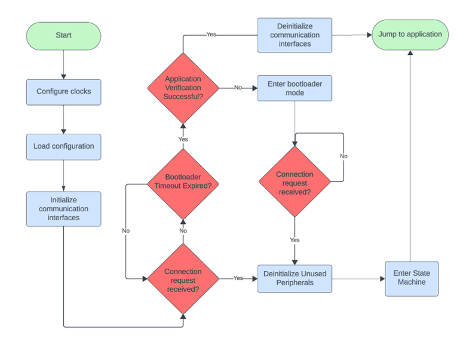
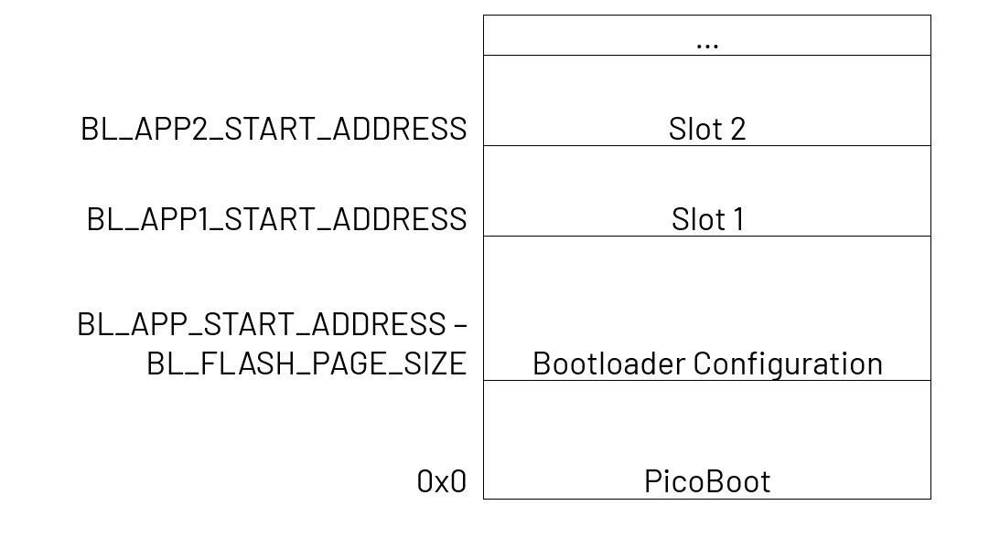

# Bootloader Operation

When the system is reset, it will start up in the bootloader application. During this phase, the bootloader waits for a connection request across all its supported peripherals for a duration specified by BL_TIMEOUT_MS. Should a connection request be made, a timeout defined by BL_COMMAND_TIMEOUT_MS will be set for subsequent packets from the host. If no connection request are made within the designated period, the bootloader proceeds to verify the user application image and jumps to the application if verification is successful. If the bootloader fails to verify the image, it enters bootloader mode, in which case it continues to accept messages from the host with no timeout.

- **BL_TIMEOUT_MS:** Number of milliseconds the bootloader will wait for a connection request before jumping to the user application.
- **BL_COMMAND_TIMEOUT_MS:** Number of milliseconds the bootloader will wait for a command before jumping to the user application.

## Flowchart

## Memory Layout

## Bootloader Configuration
The bootloader configuration resides in Flash and stores the currently active slot, slot configurations for each configured slot, and a CRC32 checksum for the configuration itself. When the bootloader application starts, it will verify that the configuration is valid by computing the checksum. If it is not, it will write the default configuration to Flash.